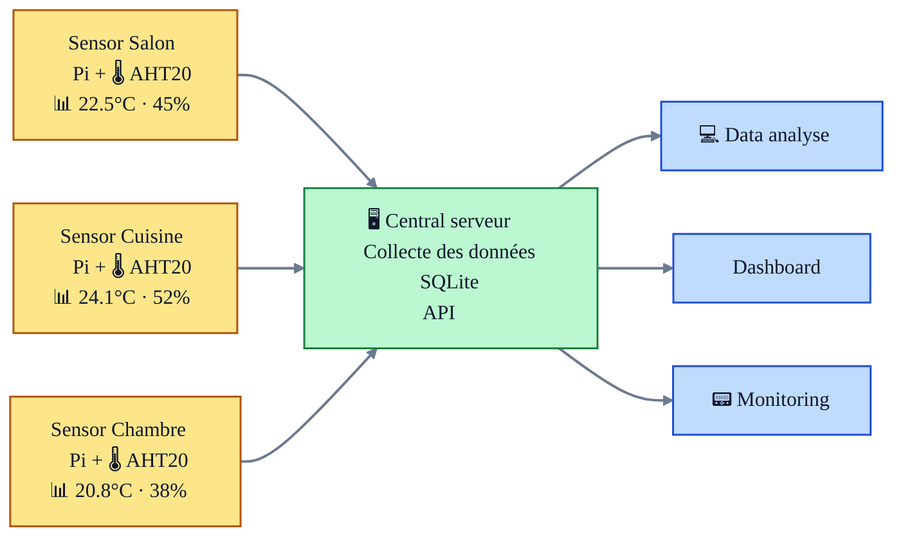

# 🌡️ TechTemp IoT Platform

A complete home monitoring solution: deploy Raspberry Pi sensors throughout your home, collect temperature/humidity data via MQTT, and access everything through a REST API.

## 🏠 **How TechTemp Works**

**1. Install sensors in your rooms**
- Place Raspberry Pi + AHT20 sensors in different rooms
- Each Pi automatically sends data every few minutes via MQTT
- Precise temperature & humidity tracking (±0.3°C accuracy)

**2. Run the central server** 
- Collects all sensor data via MQTT
- Stores readings in SQLite database for historical tracking
- Provides REST API for accessing readings and device management

**3. Build your applications**
- Use the API for dashboards, alerts, automation systems
- Integrate with Home Assistant, custom apps, monitoring solutions
- Example: Included simple web dashboard for real-time monitoring


## 🏗️ **System Overview**

Here's how your TechTemp network will look once set up:



---

## 🚪 **Choose Your Path** 

TechTemp serves different audiences with tailored documentation:

<table>
<tr>
<th width="33%" style="text-align: center;">👤 <strong>END USER</strong></th>
<th width="33%" style="text-align: center;">👩‍💻 <strong>DEVELOPER</strong></th>
<th width="33%" style="text-align: center;">🏗️ <strong>CONTRIBUTOR</strong></th>
</tr>
<tr>
<td valign="top">

*Want to monitor your home/office?*

**You need:** Room monitoring solution  
**Time:** 30 min setup + 10 min per sensor

**[📱 Start Here →](docs/USER/README.md)**
- Quick setup guide
- Device installation
- Troubleshooting


</td>
<td valign="top">

*Building apps with TechTemp API?*

**You need:** API integration guide  
**Time:** 15 min to first API call

**[⚡ Start Here →](docs/DEVELOPER/README.md)**
- API reference & examples
- SDKs and client libraries
- Integration patterns
- Testing and debugging

</td>
<td valign="top">

*Contributing to TechTemp?*

**You need:** Development environment  
**Time:** 20 min setup + architecture overview

**[🏗️ Start Here →](docs/CONTRIBUTOR/README.md)**
- Development setup
- Architecture deep-dive
- Coding standards
- Release process

</td>
</tr>
</table>


## ⚡ **Quick Demo** 

**⚠️ Prerequisites Required:**
- Docker & Docker Compose installed
- MQTT broker (Mosquitto) running

```bash
# 1. Clone the repository
git clone https://github.com/laurent987/techtemp.git
cd techtemp

# 2. Set up environment (see docs/DEVELOPER/ for details)
cp .env.example .env
# Edit .env with your MQTT broker settings

# 3. Start the system
docker compose up -d

# 4. Check the API is running
curl http://localhost:3000/api/v1/health

# 5. Create demo devices
curl -X POST http://localhost:3000/api/v1/devices \
  -H "Content-Type: application/json" \
  -d '{"device_uid": "living-room-01", "room_name": "Living Room", "label": "Main Sensor"}'

curl -X POST http://localhost:3000/api/v1/devices \
  -H "Content-Type: application/json" \
  -d '{"device_uid": "kitchen-01", "room_name": "Kitchen", "label": "Kitchen Sensor"}'

# 6. Add some test data
curl -X POST http://localhost:3000/api/v1/readings \
  -H "Content-Type: application/json" \
  -d '{"device_uid": "living-room-01", "temperature": 22.5, "humidity": 45.2}'

curl -X POST http://localhost:3000/api/v1/readings \
  -H "Content-Type: application/json" \
  -d '{"device_uid": "kitchen-01", "temperature": 24.1, "humidity": 52.8}'

# 7. Check your data
curl http://localhost:3000/api/v1/devices
curl http://localhost:3000/api/v1/readings/latest

# 8. View dashboard with real data
open http://localhost:3000
```

**📖 For complete setup:** See [User Guide](docs/USER/README.md) or [Developer Guide](docs/DEVELOPER/README.md)

---

## 📦 **What's in This Repository**

TechTemp is organized into clear, purpose-built components:

**� Core System:**
- **� Backend Server** (`/backend/`) - Node.js service with MQTT ingestion, SQLite database, and REST API
- **📡 Device Firmware** (`/device/`) - C code for Raspberry Pi sensors with AHT20 integration and MQTT publishing
- **🌐 Web example** (`/web-example/`) - Buildless HTML+JS reference dashboard, served by the backend out of the box
- **📊 Reference dashboard** (`/dashboard/`) - Optional React + Chakra UI app with historical charts; deploy with `./scripts/admin/deploy-robust-pi.sh --with-dashboard`

**📚 Documentation:**
- **👤 USER** - Complete setup guides for home monitoring (30-min installation)
- **🔧 DEVELOPER** - API reference, integration examples, and development guides  
- **🏗️ CONTRIBUTOR** - Architecture, coding standards, and contribution workflow

**🚀 Deployment & Tools:**
- **� Scripts** - Automated setup, provisioning, and monitoring tools
- **🐳 Docker** - Complete containerized deployment with docker-compose
- **🧪 Tests** - Comprehensive test suite for all components

**Result:** Everything you need to deploy, develop with, or contribute to TechTemp.

## 🤝 **Contributing Quick Links**

- **🐛 Bug Reports:** [Create Issue](https://github.com/laurent987/techtemp/issues/new?template=bug_report.md)
- **✨ Feature Requests:** [Create Issue](https://github.com/laurent987/techtemp/issues/new?template=feature_request.md)  
- **💬 Questions:** [GitHub Discussions](https://github.com/laurent987/techtemp/discussions)
- **🔧 Development:** [Contributor Guide](docs/CONTRIBUTOR/README.md)

## 📄 **License & Support**

- **License:** MIT License - see [LICENSE](LICENSE)
- **Maintainer:** Laurent ([@laurent987](https://github.com/laurent987))
- **Status:** Active development, production-ready

---

<div align="center">

**🌡️ TechTemp** - Professional IoT platform for environmental monitoring

[](#) 
[](#)
[](#)
[](#)

[🚀 Get Started](#-choose-your-path) • [📚 Documentation](docs/) • [💻 GitHub](https://github.com/laurent987/techtemp)

</div>
