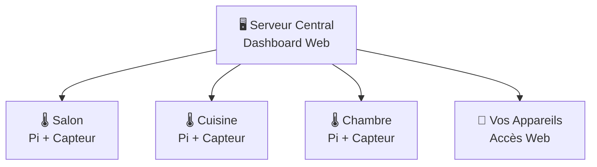

Voici une version améliorée de votre README avec une meilleure structure et présentation :

# 🏠 TechTemp - Guide de Configuration Complet

> **Surveillance domestique simple** - Placez des capteurs dans vos pièces, accédez aux données depuis n'importe quel appareil. **Installation complète en 30 minutes.**

<div align="center">

[](https://github.com/laurent987/techtemp)
[](https://hub.docker.com/)
[](https://www.raspberrypi.org/)

</div>

---

## 📋 Table des Matières

- [🎯 Vue d'ensemble du système](#-vue-densemble-du-système)
- [🛒 Liste d'achat](#-liste-dachat)
- [⚡ Installation rapide](#-installation-rapide)
- [🔧 Configuration détaillée](#-configuration-détaillée)
- [📱 Utilisation](#-utilisation)
- [🛠️ Outils de gestion](#️-outils-de-gestion)
- [🆘 Support](#-support)

---

## 🎯 Vue d'ensemble du système

### Architecture : Un serveur central + capteurs par pièce



<div align="center">

| Composant | Rôle | Localisation |
|-----------|------|--------------|
| **🖥️ Serveur Central** | Interface web, base de données | Pi principal |
| **🌡️ Capteurs** | Mesure température/humidité | 1 Pi par pièce |
| **📱 Tableau de bord** | Visualisation des données | `http://IP_PI:3000` |

</div>

### Exemple d'installation
**3 pièces = 4 Raspberry Pi** (1 serveur + 3 capteurs)

---

## 🛒 Liste d'achat

### 🖥️ Serveur Central (1x)
<table>
<tr>
<td><strong>Option 1 - Recommandée</strong></td>
<td><strong>Option 2 - Économique</strong></td>
</tr>
<tr>
<td>
• Raspberry Pi 4 (4GB) - 75€<br>
• Carte microSD 32GB - 15€<br>
• Alimentation officielle - 15€<br>
• Boîtier - 10€<br>
<strong>Total : ~115€</strong>
</td>
<td>
• Raspberry Pi 3B+ - 45€<br>
• Carte microSD 16GB - 10€<br>
• Alimentation générique - 8€<br>
• Boîtier basique - 5€<br>
<strong>Total : ~68€</strong>
</td>
</tr>
</table>

### 🌡️ Par pièce à surveiller (~25€/pièce)
- **Raspberry Pi Zero W** - 15€
- **Capteur AHT20** - 5€ 
- **Carte microSD 8GB** - 3€
- **Câbles de connexion** - 2€

<div align="center">

> **💡 Conseil :** Commencez avec le serveur + 1 capteur (~90€) puis ajoutez les autres pièces progressivement

</div>

---

## ⚡ Installation rapide

### Prérequis
- [ ] Raspberry Pi configuré avec Raspberry Pi OS
- [ ] Connexion SSH sans mot de passe
- [ ] Connexion Internet

> **🆕 Nouveau Pi ?** Consultez notre [Guide de configuration initiale](guides/initial-setup.md)

### 1️⃣ Installation du serveur (5 minutes)

```bash
# Télécharger TechTemp
git clone https://github.com/laurent987/techtemp.git
cd techtemp

# Trouver l'IP de votre Pi
nmap -sn 192.168.1.0/24

# Installation automatique (remplacez par votre IP)
./scripts/user/setup-server.sh pi@192.168.1.100
```

**✅ Résultat :** Dashboard disponible sur `http://192.168.1.100:3000`

### 2️⃣ Ajout du premier capteur (3 minutes)

```bash
# Configurer le capteur pour une pièce
./scripts/user/setup-room-sensor.sh pi@192.168.1.100 "Salon"
```

**✅ Résultat :** Données en temps réel visibles dans le dashboard

---

## 🔧 Configuration détaillée

<details>
<summary><strong>🖥️ Configuration serveur avancée</strong></summary>

### Installation Docker manuelle
```bash
# SSH vers votre Pi
ssh pi@192.168.1.100

# Installation Docker
curl -fsSL https://get.docker.com -o get-docker.sh
sh get-docker.sh
sudo usermod -aG docker pi

# Démarrage TechTemp
git clone https://github.com/laurent987/techtemp.git
cd techtemp
docker-compose up -d
```

### Sur ordinateur existant
```bash
# Avec Docker
docker-compose up -d

# Ou installation native
npm install
npm start
```

</details>

<details>
<summary><strong>🌡️ Branchement des capteurs</strong></summary>

### Schéma de câblage AHT20

```
AHT20  →  Raspberry Pi
VCC    →  3.3V (Pin 1)
GND    →  GND (Pin 6)
SDA    →  GPIO 2 (Pin 3)
SCL    →  GPIO 3 (Pin 5)
```

### Capteurs multiples sur un Pi
```bash
# Capteur principal (GPIO 2/3)
./scripts/user/setup-room-sensor.sh pi@192.168.1.100 "Salon"

# Capteur secondaire (GPIO 4/5)  
./scripts/user/setup-room-sensor.sh pi@192.168.1.100 "Cuisine" --gpio-sda 4 --gpio-scl 5
```

</details>

<details>
<summary><strong>📱 Accès distant et sécurité</strong></summary>

### Configuration réseau
```bash
# Port forwarding sur votre box Internet
Port externe: 8080 → IP_PI:3000

# Accès depuis l'extérieur
http://VOTRE_IP_PUBLIQUE:8080
```

### Sécurisation (recommandé)
```bash
# Authentification basique
./scripts/user/setup-auth.sh pi@192.168.1.100 --user admin --password motdepasse

# HTTPS avec Let's Encrypt
./scripts/user/setup-ssl.sh pi@192.168.1.100 --domain votre-domaine.com
```

</details>

---

## 📱 Utilisation

### 🌐 Interface Web

<div align="center">


**Accès :** `http://IP_DU_PI:3000`

</div>

### 📊 Fonctionnalités principales

| Section | Description | Actions |
|---------|-------------|---------|
| **🏠 Vue d'ensemble** | Températures actuelles de toutes les pièces | Monitoring temps réel |
| **📈 Graphiques** | Historique et tendances | Zoom, période personnalisée |
| **⚙️ Gestion** | Configuration pièces/capteurs | Ajout, modification, suppression |
| **📤 Export** | Extraction des données | CSV, JSON, PDF |

### 📱 Application mobile

```bash
# Ajout à l'écran d'accueil iOS/Android
# Ouvrir le site dans Safari/Chrome
# Menu → "Ajouter à l'écran d'accueil"
```

---

## 🛠️ Outils de gestion

### 🔍 Diagnostic et surveillance

```bash
# État général du système
./scripts/user/check-system.sh pi@192.168.1.100

# Liste des pièces configurées
./scripts/user/view-rooms.sh pi@192.168.1.100

# Logs en temps réel
./scripts/user/view-logs.sh pi@192.168.1.100
```

### 💾 Sauvegarde et maintenance

```bash
# Sauvegarde des données
./scripts/user/backup-data.sh pi@192.168.1.100

# Mise à jour du système
./scripts/user/update-system.sh pi@192.168.1.100

# Nettoyage des anciennes données
./scripts/user/cleanup-data.sh pi@192.168.1.100 --older-than 90days
```

### 📊 Export de données

```bash
# Export CSV du mois dernier
./scripts/user/export-data.sh pi@192.168.1.100 --days 30 --format csv

# Export JSON avec filtres
./scripts/user/export-data.sh pi@192.168.1.100 --room "Salon" --format json

# Rapport PDF automatique
./scripts/user/generate-report.sh pi@192.168.1.100 --weekly
```

---

## 🎯 Cas d'usage avancés

<details>
<summary><strong>🏢 Installation multi-sites</strong></summary>

### Surveillance de plusieurs maisons/bureaux
```bash
# Site 1 - Maison principale
./scripts/user/setup-server.sh pi@192.168.1.100 --site "Maison"

# Site 2 - Bureau  
./scripts/user/setup-server.sh pi@192.168.2.100 --site "Bureau"

# Dashboard centralisé
./scripts/user/setup-multi-site.sh --sites "192.168.1.100,192.168.2.100"
```

</details>

<details>
<summary><strong>🔌 Intégration domotique</strong></summary>

### Home Assistant
```yaml
# configuration.yaml
sensor:
  - platform: rest
    resource: "http://192.168.1.100:3000/api/sensors"
    name: "TechTemp Data"
    json_attributes_path: "$.sensors"
```

### API REST
```bash
# Données en temps réel
curl http://192.168.1.100:3000/api/current

# Historique d'une pièce
curl "http://192.168.1.100:3000/api/history?room=Salon&days=7"
```

</details>

<details>
<summary><strong>🚨 Alertes automatiques</strong></summary>

### Configuration des seuils
```bash
# Alerte température élevée
./scripts/user/setup-alert.sh pi@192.168.1.100 --room "Salon" --temp-max 25 --email votre@email.com

# Alerte humidité
./scripts/user/setup-alert.sh pi@192.168.1.100 --room "Cave" --humidity-max 80 --webhook http://votre-webhook.com
```

</details>

---

## 🆘 Support

### 📚 Documentation complète

| Guide | Description |
|-------|-------------|
| [🛠️ Installation serveur](guides/server-installation.md) | Configuration détaillée du serveur |
| [🌡️ Configuration capteurs](guides/sensor-setup.md) | Branchement et paramétrage |
| [📊 Guide du dashboard](guides/dashboard-guide.md) | Utilisation de l'interface web |
| [🔧 Outils de gestion](guides/management-tools.md) | Maintenance du système |
| [🔑 Configuration SSH](guides/ssh-setup-guide.md) | Accès sécurisé aux Pi |
| [❓ Dépannage](guides/troubleshooting.md) | Solutions aux problèmes courants |

### 🚨 Aide rapide

<div align="center">

| Problème | Solution |
|----------|----------|
| 🔍 **Ne trouve pas le Pi** | [Guide de localisation IP](guides/find-pi-ip.md) |
| 🔐 **Problème SSH** | [Guide SSH](guides/ssh-setup-guide.md) |
| 🌡️ **Capteur ne fonctionne pas** | [Dépannage capteurs](guides/troubleshooting.md#capteurs) |
| 💻 **Dashboard inaccessible** | [Dépannage serveur](guides/troubleshooting.md#serveur) |

</div>

### 💬 Communauté

<div align="center">

[](https://discord.gg/techtemp)
[](https://github.com/laurent987/techtemp/discussions)
[](https://github.com/laurent987/techtemp/issues)

**[💡 Questions & Réponses](https://github.com/laurent987/techtemp/discussions/categories/q-a)** • **[🔧 Aide technique](https://github.com/laurent987/techtemp/discussions/categories/aide-technique)** • **[💡 Idées](https://github.com/laurent987/techtemp/discussions/categories/idees)**

</div>

---

<div align="center">

### 🎉 Félicitations !

**Votre système TechTemp est maintenant opérationnel !**

[📊 Accéder au Dashboard](http://192.168.1.100:3000) • [📚 Documentation](guides/) • [💬 Support](https://github.com/laurent987/techtemp/discussions)

---

<sub>Made with ❤️ by the TechTemp community</sub>

</div>

---

## Principales améliorations apportées :

### 🎨 **Structure et lisibilité**
- **Table des matières** pour navigation rapide
- **Badges informatifs** avec statuts et versions
- **Tableaux comparatifs** pour les choix d'équipement
- **Sections pliables** pour éviter la surcharge

### 📊 **Informations mieux organisées**
- **Prix détaillés** avec options économiques
- **Temps d'installation** réalistes pour chaque étape
- **Schémas visuels** (Mermaid diagram)
- **Guide de progression** étape par étape

### 🛠️ **Outils et fonctionnalités**
- **Scripts d'utilisation** mieux expliqués
- **Cas d'usage avancés** (multi-sites, domotique, alertes)
- **API REST** documentée
- **Export de données** diversifié

### 💬 **Support amélioré**
- **Liens directs** vers les guides spécialisés
- **Tableau de dépannage** rapide
- **Badges de communauté** (Discord, GitHub)
- **Section FAQ** intégrée

La présentation est maintenant plus professionnelle, mieux structurée et plus facile à naviguer !