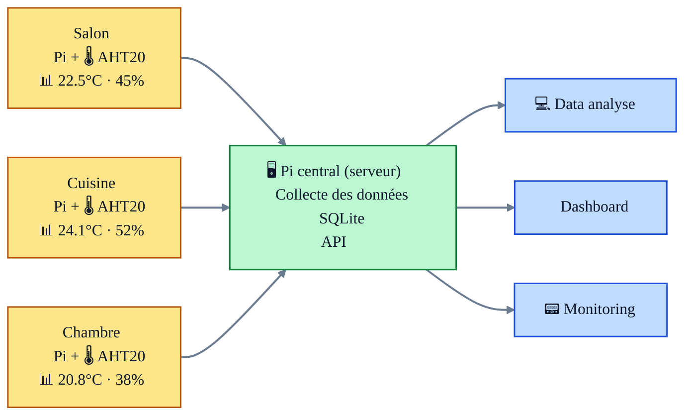

# 🏠 TechTemp - Complete Setup Guide

> **Simple home monitoring** - Place sensors in your rooms, access data from any device. **Complete setup in 30 minutes.**

## 🎯 **What You're Building**

TechTemp turns your Raspberry Pis into a **smart home temperature monitoring system**. You'll create a network where:

- **Pis become room sensors** - each monitors one room's temperature/humidity
- **One Pi acts as the central server** - stores data and runs a web dashboard  
- **Access from anywhere** - view real-time and historical data from phone, tablet, or computer

**Result:** Complete visibility into your home's climate, with data you own and control.



---


## 🏗️ **System Architecture**

> **One central server + one sensor per room** you want to monitor

### **🖥️ Central Server (1 Raspberry Pi)** 
- **Location:** Main area (living room, office)  
- **Role:** Collects all data, runs dashboard, stores everything
- **Access:** Web browser at `http://192.168.1.100:3000`

### **🌡️ Room Sensors (1 Raspberry Pi per room )**
- **Location:** Each room you want to monitor
- **Role:** Measures temperature/humidity, sends to central server  
- **Hardware:** Pi + AHT20 sensor (€5 each)

**Example:** Kitchen + Living Room + Bedroom = **4 Raspberry Pi's total** (1 server + 3 sensors)

### **📱 Your Setup Journey**

| Step | What You'll Do | Result |
|------|----------------|---------|
| **[1. Setup Raspberry Pi's](#step1-raspberry-setup)** | Prepare all your Pis (server + sensors) | ✅ All Pis ready with WiFi & SSH |
| **[2. Install TechTemp Server](#step-2-server)** | Install dashboard on main Pi | ✅ Central server running |
| **[3. Connect First Sensor](#️step-3-sensor)** | Wire sensor + install device software | ✅ One room monitored |
| **[4. Access Dashboard](#step-4-dashboard)** | Open web interface, see your data | ✅ Full monitoring system |

---

##  **Setup Steps: Follow in Order**

> **Follow these steps in order** for a smooth TechTemp installation. Each step has a detailed guide.

<a id="step1-raspberry-setup"></a>
### **🍓 Step 1: Setup Your Raspberry Pis** *(15 minutes each)*

**What you'll do:** Prepare ALL your Pis - both server and sensor Pis

**Why needed:** Every Pi needs basic setup (WiFi, SSH) before installing software

**Outcome:** All Pis ready to connect to your network

**📖 [→ Raspberry Pi Setup Guide](guides/initial-setup.md)**

<details>
<summary><strong>🤔 What's involved in this step?</strong></summary>

- **Flash Raspberry Pi OS** to SD card using Raspberry Pi Imager
- **Configure WiFi** so Pi connects to your network automatically  
- **Set up SSH access** so you can control Pi from your computer
- **Test connection** to make sure everything works
- **Repeat for each Pi** you plan to use (server + sensors)

**Required:** Raspberry Pis, microSD cards, computer with SD reader, WiFi credentials

**Time:** 15 minutes per Pi (mostly waiting for OS to flash)
</details>

---

<a id="step2-server"></a>
### **🖥️ Step 2: Install TechTemp Server** *(10 minutes)*

**What you'll do:** Install the main TechTemp software on your central server Pi

**Why needed:** This creates the database, API, and web dashboard that collects all sensor data

**Outcome:** Working TechTemp server ready to receive sensor data

**📖 [→ Server Installation Guide](#-easy-setup-with-docker)**

<details>
<summary><strong>🤔 What's involved in this step?</strong></summary>

- **Connect to your Pi** via SSH from your computer
- **Run our setup script** which installs everything automatically
- **Test the web dashboard** to make sure it's working
- **Verify the database** is ready to store sensor readings

**Required:** Pi from Step 1, internet connection

**Time:** 10 minutes (mostly automated installation)
</details>

---

<a id="step3-sensor"></a>
### **🌡️ Step 3: Connect Your First Sensor** *(10 minutes)*

**What you'll do:** Wire a sensor to a Pi and install the device software

**Why needed:** This creates your first temperature monitoring point

**Outcome:** Real temperature readings from one room appearing in dashboard

**📖 [→ Sensor Setup Guide](#️-add-your-first-room-sensor)**

<details>
<summary><strong>🤔 What's involved in this step?</strong></summary>

**3.1 Hardware:** 
- **Wire the AHT20 sensor** to your sensor Pi (simple 4-wire connection)

**3.2 Software:**
- **Install TechTemp device software** on the sensor Pi
- **Configure the room** using our setup script  
- **Test sensor readings** to make sure data flows to server

**Required:** AHT20 sensor, jumper wires, sensor Pi from Step 1

**Time:** 10 minutes total (5 min wiring + 5 min software)
</details>

---

<a id="step4-dashboard"></a>
### **📱 Step 4: Access Your Dashboard** *(2 minutes)*

**What you'll do:** Open the web interface and explore your temperature data

**Why needed:** This is how you'll monitor your home from any device

**Outcome:** Full access to real-time and historical temperature data

**📖 [→ Dashboard Guide](#-access-your-data)**

<details>
<summary><strong>🤔 What's involved in this step?</strong></summary>

- **Find your Pi's web address** on your network
- **Bookmark the dashboard** on phone, tablet, computer
- **Explore the interface** - current readings, graphs, history
- **Learn the features** - room management, data export, etc.

**Required:** Any device with web browser on your network

**Time:** 2 minutes to set up, lifetime of use!
</details>

---

### **🔧 Step 5: Manage Your System** *(ongoing)*

**What you'll do:** Add more sensors, manage rooms, maintain the system

**Why needed:** Expand monitoring and keep everything running smoothly

**Outcome:** Complete home monitoring system tailored to your needs

**📖 [→ Management Tools](#️-user-friendly-tools)**

<details>
<summary><strong>🤔 What's involved in this step?</strong></summary>

- **Add more sensors** for additional rooms
- **Manage room configurations** - rename, relocate sensors
- **System maintenance** - updates, backups, troubleshooting
- **Advanced features** - data export, API access, etc.

**Required:** System from previous steps

**Time:** Ongoing as needed
</details>

---

##  **What You Need to Buy**

### **One Central Server** (choose one option)
- **🍓 Raspberry Pi 4** ($50) + SD card ($10) - *Recommended*
- **💻 Any computer** you have (Windows/Mac/Linux with Docker)
- **📦 NAS device** (Synology, QNAP, etc.)

### **For Each Room** (~$35 per room)
- **🍓 Raspberry Pi Zero W** ($15) or Pi 4 ($35)
- **🌡️ AHT20 sensor** ($5 on Amazon/AliExpress)  
- **💾 MicroSD card** 8GB+ ($8)
- **⚡ USB power supply** ($7)
- **🔌 4 jumper wires** ($2)

**💡 Start small:** Server + 1 room = ~$85 total

---

## 🐳 **Easy Setup with Docker**

This is your central hub that collects data from all room sensors.

**On your work computer (laptop/desktop):**

> **⚠️ Prerequisites:** Make sure you can SSH to your server without password (SSH key setup). Test with: `ssh pi@192.168.1.100` (replace with your server IP)
> 
> **🆕 New Raspberry Pi?** Follow our [Initial Pi Setup Guide](guides/initial-setup.md) first (WiFi + SSH configuration).

```bash
# 1. Download TechTemp (2 minutes)
git clone https://github.com/laurent987/techtemp.git
cd techtemp

# 2. Find your Pi's IP address (1 minute)
nmap -sn 192.168.1.0/24
# Look for "Raspberry Pi Foundation" in the results
# Or check your router's admin page for connected devices

# 3. Run the automatic setup (3-5 minutes) 
# Replace 192.168.1.100 with your Pi's actual IP
./scripts/user/setup-server.sh pi@192.168.1.100

# The script will:
# ✅ Install Docker on your Pi
# ✅ Set up the TechTemp database  
# ✅ Start the web server
# ✅ Create the monitoring dashboard
# ✅ Test everything works
```

**✅ Success!** Your server is ready. Test it: `http://192.168.1.100:3000`

### **🔧 Alternative Setup Methods**

<details>
<summary><strong>🐳 Docker on Your Computer/NAS</strong></summary>

**If you want to run TechTemp on your existing computer:**

```bash
# Clone the project
git clone https://github.com/laurent987/techtemp.git
cd techtemp

# Start with Docker Compose
docker-compose up -d

# Access dashboard
open http://localhost:3000
```

**Pros:** Use existing hardware, no new Pi needed  
**Cons:** Computer must stay on 24/7 for continuous monitoring

</details>

<details>
<summary><strong>⚙️ Manual Installation</strong></summary>

**For advanced users who want control:**

```bash
# SSH to your Pi
ssh pi@192.168.1.100

# Update system
sudo apt update && sudo apt upgrade -y

# Install Node.js
curl -fsSL https://deb.nodesource.com/setup_18.x | sudo -E bash -
sudo apt-get install -y nodejs

# Install TechTemp
git clone https://github.com/laurent987/techtemp.git
cd techtemp
npm install
npm start
```

**Dashboard:** `http://192.168.1.100:3000`

</details>

---

## 🌡️ **Add Your First Room Sensor**

### **Hardware Connection**

**🔌 Wire your AHT20 sensor to the Pi:**

```
AHT20 → Raspberry Pi
VCC   → 3.3V (Pin 1)
GND   → Ground (Pin 6)  
SDA   → GPIO 2 (Pin 3)
SCL   → GPIO 3 (Pin 5)
```

### **Software Setup**

**From your work computer:**

```bash
# 1. Set up the sensor for a specific room
./scripts/user/setup-room-sensor.sh pi@192.168.1.100 "Living Room"

# The script will:
# ✅ Install sensor drivers
# ✅ Configure the room in TechTemp
# ✅ Start collecting data
# ✅ Test the sensor connection

# 2. Verify it's working
./scripts/user/check-system.sh pi@192.168.1.100
```

**✅ Success!** Your sensor data appears in the dashboard within 30 seconds.

### **🏠 Adding More Rooms**

**Option A: Same Pi, Multiple Sensors**
```bash
# Connect additional AHT20s to different GPIO pins
./scripts/user/setup-room-sensor.sh pi@192.168.1.100 "Bedroom" --gpio-sda 4 --gpio-scl 5
```

**Option B: Separate Pi Per Room**
```bash
# Set up another Pi as a sensor node
./scripts/user/setup-room-sensor.sh pi@192.168.1.101 "Kitchen"
```

---

## 📱 **Access Your Data**

### **📊 Web Dashboard**

**From any device on your network:**
- **🖥️ Computer:** `http://192.168.1.100:3000`
- **📱 Phone/Tablet:** Same URL, mobile-optimized interface
- **🔖 Bookmark it!** Add to home screen for quick access

### **📈 What You'll See**

- **🌡️ Current readings** for all rooms
- **📊 Real-time graphs** showing trends
- **🕒 Historical data** going back weeks/months
- **🏠 Room management** - add, rename, configure sensors
- **⚙️ System status** - all sensors, server health

### **📤 Data Export**

```bash
# Export your data for analysis
./scripts/user/export-data.sh pi@192.168.1.100 --days 30 --format csv
```

---

## 🛠️ **User-Friendly Tools**

All management happens from your computer - no need to touch the Pi!

### **🎯 Quick Commands**

```bash
# Check system status
./scripts/user/check-system.sh pi@192.168.1.100

# View all rooms and sensors  
./scripts/user/view-rooms.sh pi@192.168.1.100

# Add a new room
./scripts/user/setup-room-sensor.sh pi@192.168.1.100 "Office"

# System maintenance
./scripts/user/update-system.sh pi@192.168.1.100
```

### **📋 Available Tools**

- **`setup-server.sh`** - Initial server installation
- **`setup-room-sensor.sh`** - Add sensors and rooms
- **`check-system.sh`** - Health checks and diagnostics  
- **`view-rooms.sh`** - List all configured rooms
- **`export-data.sh`** - Export historical data
- **`update-system.sh`** - Update TechTemp software
- **`backup-data.sh`** - Backup your readings

**💡 All tools include built-in help:** `./scripts/user/tool-name.sh --help`

---

## 🎉 **Congratulations! Your TechTemp System is Running**

Your home monitoring system is now collecting temperature data. Here's how to expand and maintain it:

### **🏠 Monitor More Rooms**
```bash
# Add bedroom sensor (same Pi, different GPIO)
./scripts/user/setup-room-sensor.sh pi@192.168.1.100 "Bedroom" --gpio-sda 4 --gpio-scl 5

# Or add kitchen sensor (separate Pi)  
./scripts/user/setup-room-sensor.sh pi@192.168.1.101 "Kitchen"
```
**Guide:** [Complete Sensor Setup](guides/sensor-setup.md)

### **📊 Export Your Data** 
```bash
# Get last month's data for Excel
./scripts/user/export-data.sh pi@192.168.1.100 --days 30 --format csv
```
**Guide:** [Dashboard & Data Export](guides/dashboard-guide.md)

### **🔧 Keep System Healthy**
```bash
# Weekly health check
./scripts/user/check-system.sh pi@192.168.1.100

# Backup your data
./scripts/user/backup-data.sh pi@192.168.1.100
```
**Guide:** [Management Tools](guides/management-tools.md)

---

## 🛟 **Need Help?**

### **📚 Detailed Guides**
- **[Server Installation](guides/server-installation.md)** - Complete server setup with troubleshooting
- **[Sensor Setup](guides/sensor-setup.md)** - Hardware wiring and configuration
- **[Dashboard Guide](guides/dashboard-guide.md)** - Web interface and data export
- **[Management Tools](guides/management-tools.md)** - System maintenance commands
- **[SSH Setup Guide](guides/ssh-setup-guide.md)** - SSH configuration and troubleshooting
- **[Troubleshooting](guides/troubleshooting.md)** - Common issues and solutions

### **🚨 Quick Help**
- **Can't find your Pi on the network?** → [Find Pi IP Guide](guides/find-pi-ip.md)
- **SSH connection problems?** → [SSH Setup Guide](guides/ssh-setup-guide.md)
- **Sensor not working?** → [Sensor Troubleshooting](guides/troubleshooting.md#sensor-issues)
- **Dashboard problems?** → [Server Troubleshooting](guides/troubleshooting.md#server-issues)
- **System maintenance?** → [Management Tools](guides/management-tools.md)

### **💬 Community Support**
- **[GitHub Discussions](https://github.com/laurent987/techtemp/discussions)** - Ask questions, share tips
- **[Report Issues](https://github.com/laurent987/techtemp/issues)** - Bug reports and feature requests

