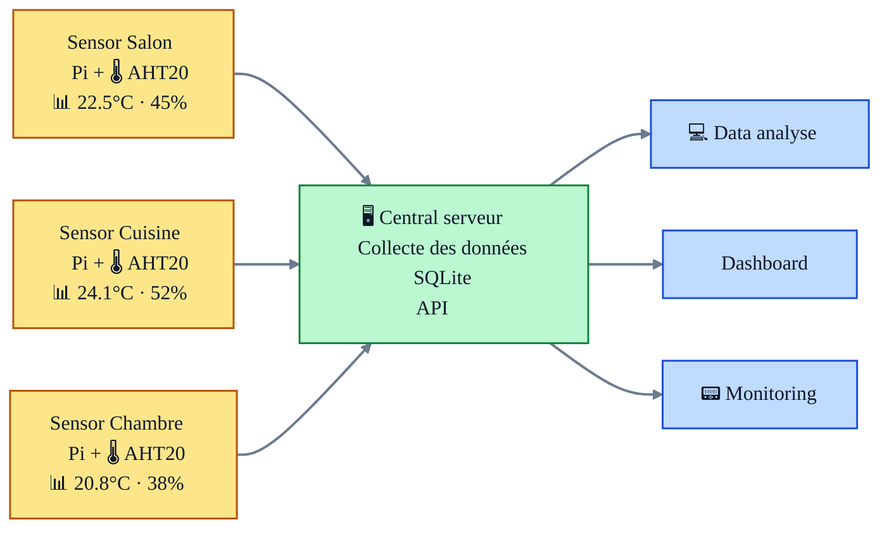

# 🏠 TechTemp - Complete Setup Guide

> **Simple home monitoring** - Place sensors in your rooms, access data from any device. **Complete setup in 30 minutes.**

##  **What You're Building**

TechTemp transforms simple Raspberry Pis into a **professional home monitoring system** using affordable AHT20 sensors. In just 30 minutes, you'll have:

**🏠 Room-by-room monitoring:**
- **Each Pi becomes a smart sensor** - precise temperature & humidity tracking
- **Automatic data collection** - readings every few minutes, 24/7
- **No monthly fees** - your data stays on your network

**📊 Central intelligence:**
- **One server Pi** - collects, stores, and serves all your data  
- **Web dashboard** - beautiful graphs and real-time readings
- **Historical data** - track patterns, spot trends, export data

**📱 Access anywhere:**
- **Any device** - phone, tablet, laptop works instantly
- **No apps to install** - just open your web browser
- **Your network** - fast, private, always available

**Result:** Professional-grade climate monitoring that costs ~$50 per room and takes 30 minutes to set up.

## 🛒 **Shopping List** *(~$80 to start)*

### **🖥️ Central Server** *(one-time setup)*
- ** Raspberry Pi Zero 2W** ~$15
- **💾 MicroSD card 32GB** ~$8 *(stores all sensor data)*

### **🌡️ Per Room Sensor** *(~$50 each)*
- ** Raspberry Pi Zero 2W** ~$15
- **🌡️ AHT20 sensor** ~$25 *(accurate ±0.3°C)*
- **💾 MicroSD card 8GB** ~$5 *(device software only)*
- **🔌 4 jumper wires** ~$2 *(GPIO connection)*

**💡 Smart start:** Begin with server + 1 room (~$80), then add rooms as needed

## 🏗️ **System Overview**

Here's how your TechTemp network will look once set up:

```mermaid
%%{
  init: {
    "theme": "base",
    "themeVariables": {
      "fontFamily": "Inter, Segoe UI, Roboto, Arial, sans-serif",
      "primaryColor": "#BFDBFE",
      "primaryBorderColor": "#1F2937",
      "primaryTextColor": "#0F172A",
      "lineColor": "#64748B",
      "tertiaryColor": "#F1F5F9"
    }
  }
}%%
flowchart LR
  linkStyle default stroke:#64748B,stroke-width:2px,opacity:0.95

  classDef sensor fill:#FDE68A,stroke:#B45309,stroke-width:1.5px,color:#0F172A
  classDef hub    fill:#BBF7D0,stroke:#15803D,stroke-width:1.5px,color:#0F172A
  classDef viewer fill:#BFDBFE,stroke:#1D4ED8,stroke-width:1.5px,color:#0F172A

  A["Sensor Salon<br/>🍓 Pi + 🌡️ AHT20<br/>📊 22.5°C · 45%"]:::sensor
  B["Sensor Cuisine<br/>🍓 Pi + 🌡️ AHT20<br/>📊 24.1°C · 52%"]:::sensor
  C["Sensor Chambre<br/>🍓 Pi + 🌡️ AHT20<br/>📊 20.8°C · 38%"]:::sensor

  D["🖥️ Central serveur<br/>📡 Collecte des données<br/>💾 SQLite<br/>API"]:::hub

  E["💻 Data analyse"]:::viewer
  F["📱 Dashboard"]:::viewer
  G["📟 Monitoring"]:::viewer

  A --> D
  B --> D
  C --> D

  D --> E
  D --> F
  D --> G

```

## ⚡ **4-Step Setup** *(30 minutes total)*

| Step | What You'll Do | Result |
|------|----------------|---------|
| **[1. Setup Raspberry Pi's](#step1-raspberry-setup)** | Prepare all your Pis (server + sensors) | ✅ All Pis ready with WiFi & SSH |
| **[2. Install TechTemp Server](#step2-server)** | Install complete server stack (database, API, dashboard) | ✅ Central server running |
| **[3. Connect First Sensor](#step3-sensor)** | Wire AHT20 sensor + install device software | ✅ One room monitored |
| **[4. Access Dashboard](#step4-dashboard)** | Open web interface, explore your data | ✅ Full monitoring system |

 

### **Step 1 - Setup Your Raspberry Pi's** *(15 minutes each)*

Set up all your Raspberry Pi's with WiFi and SSH access so they're ready for TechTemp installation.

**Ready to start?** **[Follow the Raspberry Pi Setup Guide](guides/initial-setup.md)**

---
 

### **Step 2 - Install TechTemp Server** *(10 minutes)*

Install the complete TechTemp server stack (database, API, web dashboard) on your central Pi to collect all sensor data.

**Let's install the server:** **[Follow the Server Installation Guide](guides/server-installation.md)**

---
 

### **Step 3 - Setup Sensors** *(5 minutes each)*

Wire an AHT20 sensor to a Pi and install the device software to start monitoring your first room's temperature.

**Time to add your first sensor:** **[Follow the Sensor Setup Guide](guides/sensor-setup.md)**

---
 

### **Step 4 - Monitor Your System** *(2 minutes)*

Open the web interface from any device to explore your temperature data, view graphs, and monitor your home.

**See your data in action:** **[Access Your Dashboard Now](guides/dashboard-guide.md)**

 

## 🔧 **System Management**

Add more sensors, manage rooms, and maintain your system to create a complete home monitoring solution.

**Expand your system:** **[Explore Management Tools](guides/management-tools.md)**

