# 🏠 TechTemp - Complete Setup Guide

> **Simple home monitoring** - Place sensors in your rooms, access data from any device. **Complete setup in 30 minutes.**

##  **What You Need to Have**

### **One Central Server:** 
- ** Raspberry Pi Zero 2W** 
- **💾 MicroSD card** 32GB 

### **Sensor temperature for each room:** 
- ** Raspberry Pi Zero 2W** 
- **🌡️ AHT20 sensor**   
- **💾 MicroSD card** 8GB 
- **🔌 4 jumper wires** ($2)

**💡 Start small:** Server + 1 room

## 🎯 **What You're Building**

TechTemp turns your Raspberry Pis into a **smart home temperature monitoring system**. You'll create a network where:

- **Pis become room sensors** - each monitors one room's temperature/humidity
- **One Pi acts as the central server** - stores data and runs a web dashboard  
- **Access from anywhere** - view real-time and historical data from phone, tablet, or computer

**Result:** Complete visibility into your home's climate, with data you own and control.

```mermaid
%%{
  init: {
    "theme": "base",
    "themeVariables": {
      "fontFamily": "Inter, Segoe UI, Roboto, Arial, sans-serif",
      "primaryColor": "#BFDBFE",
      "primaryBorderColor": "#1F2937",
      "primaryTextColor": "#0F172A",
      "lineColor": "#64748B",
      "tertiaryColor": "#F1F5F9"
    }
  }
}%%
flowchart LR
  linkStyle default stroke:#64748B,stroke-width:2px,opacity:0.95

  classDef sensor fill:#FDE68A,stroke:#B45309,stroke-width:1.5px,color:#0F172A
  classDef hub    fill:#BBF7D0,stroke:#15803D,stroke-width:1.5px,color:#0F172A
  classDef viewer fill:#BFDBFE,stroke:#1D4ED8,stroke-width:1.5px,color:#0F172A

  A["Sensor Salon<br/>🍓 Pi + 🌡️ AHT20<br/>📊 22.5°C · 45%"]:::sensor
  B["Sensor Cuisine<br/>🍓 Pi + 🌡️ AHT20<br/>📊 24.1°C · 52%"]:::sensor
  C["Sensor Chambre<br/>🍓 Pi + 🌡️ AHT20<br/>📊 20.8°C · 38%"]:::sensor

  D["🖥️ Central serveur<br/>📡 Collecte des données<br/>💾 SQLite<br/>API"]:::hub

  E["💻 Data analyse"]:::viewer
  F["📱 Dashboard"]:::viewer
  G["📟 Monitoring"]:::viewer

  A --> D
  B --> D
  C --> D

  D --> E
  D --> F
  D --> G

```

### **📱 Your Setup Journey**

| Step | What You'll Do | Result |
|------|----------------|---------|
| **[1. Setup Raspberry Pi's](#-step-1-setup-your-raspberry-pis-15-minutes-each)** | Prepare all your Pis (server + sensors) | ✅ All Pis ready with WiFi & SSH |
| **[2. Install TechTemp Server](#️-step-2-install-techtemp-server-10-minutes)** | Install dashboard on main Pi | ✅ Central server running |
| **[3. Connect First Sensor](#️-step-3-connect-your-first-sensor-10-minutes)** | Wire sensor + install device software | ✅ One room monitored |
| **[4. Access Dashboard](#-step-4-access-your-dashboard-2-minutes)** | Open web interface, see your data | ✅ Full monitoring system |

##  **Setup Steps **

### **🍓 Step 1: Setup Your Raspberry Pis** *(15 minutes each)*

**What you'll do:** Prepare ALL your Pis - both server and sensor Pis

**Why needed:** Every Pi needs basic setup (WiFi, SSH) before installing software

**Outcome:** All Pis ready to connect to your network

**📖 [→ Raspberry Pi Setup Guide](guides/initial-setup.md)**

<strong>🤔 What's involved in this step?</strong>

- **Flash Raspberry Pi OS** to SD card using Raspberry Pi Imager
- **Configure WiFi** so Pi connects to your network automatically  
- **Set up SSH access** so you can control Pi from your computer
- **Test connection** to make sure everything works
- **Repeat for each Pi** you plan to use (server + sensors)

**Required:** Raspberry Pis, microSD cards, computer with SD reader, WiFi credentials

**Time:** 15 minutes per Pi (mostly waiting for OS to flash)

---

### **🖥️ Step 2: Install TechTemp Server** *(10 minutes)*

**What you'll do:** Install the main TechTemp software on your central server Pi

**Why needed:** This creates the database, API, and web dashboard that collects all sensor data

**Outcome:** Working TechTemp server ready to receive sensor data

**📖 [→ Server Installation Guide](#️-step-2-install-techtemp-server-10-minutes)**

<strong>🤔 What's involved in this step?</strong>

- **Connect to your Pi** via SSH from your computer
- **Run our setup script** which installs everything automatically
- **Test the web dashboard** to make sure it's working
- **Verify the database** is ready to store sensor readings

**Required:** Pi from Step 1, internet connection

**Time:** 10 minutes (mostly automated installation)

---

### **🌡️ Step 3: Connect Your First Sensor** *(10 minutes)*

**What you'll do:** Wire a sensor to a Pi and install the device software

**Why needed:** This creates your first temperature monitoring point

**Outcome:** Real temperature readings from one room appearing in dashboard

**📖 [→ Sensor Setup Guide](#️-step-3-connect-your-first-sensor-10-minutes)**

<strong>🤔 What's involved in this step?</strong>

**3.1 Hardware:** 
- **Wire the AHT20 sensor** to your sensor Pi (simple 4-wire connection)

**3.2 Software:**
- **Install TechTemp device software** on the sensor Pi
- **Configure the room** using our setup script  
- **Test sensor readings** to make sure data flows to server

**Required:** AHT20 sensor, jumper wires, sensor Pi from Step 1

**Time:** 10 minutes total (5 min wiring + 5 min software)

---

### **📱 Step 4: Access Your Dashboard** *(2 minutes)*

**What you'll do:** Open the web interface and explore your temperature data

**Why needed:** This is how you'll monitor your home from any device

**Outcome:** Full access to real-time and historical temperature data

**📖 [→ Dashboard Guide](#-step-4-access-your-dashboard-2-minutes)**

<strong>🤔 What's involved in this step?</strong>

- **Find your Pi's web address** on your network
- **Bookmark the dashboard** on phone, tablet, computer
- **Explore the interface** - current readings, graphs, history
- **Learn the features** - room management, data export, etc.

**Required:** Any device with web browser on your network

**Time:** 2 minutes to set up, lifetime of use!

---

### **🔧 Step 5: Manage Your System** *(ongoing)*

**What you'll do:** Add more sensors, manage rooms, maintain the system

**Why needed:** Expand monitoring and keep everything running smoothly

**Outcome:** Complete home monitoring system tailored to your needs

**📖 [→ Management Tools](#-step-5-manage-your-system-ongoing)**

<strong>🤔 What's involved in this step?</strong>

- **Add more sensors** for additional rooms
- **Manage room configurations** - rename, relocate sensors
- **System maintenance** - updates, backups, troubleshooting
- **Advanced features** - data export, API access, etc.

**Required:** System from previous steps

**Time:** Ongoing as needed

---

